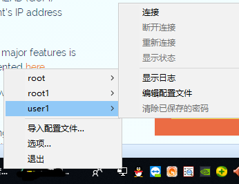
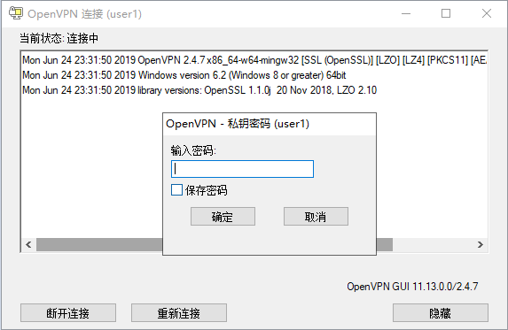

# Linux搭建

## 常用命令

### free 查看内存占用

```sh
root@iZwz90n77vus1ejogvvob4Z:~# free
total        used        free      shared  buff/cache   available
Mem:        1009024       56300      763356        2668      189368      811068
Swap:        969964           0      969964
```

### df 查看硬盘占用情况

```sh
root@iZwz90n77vus1ejogvvob4Z:~# df -hl
Filesystem      Size  Used Avail Use% Mounted on
udev            472M     0  472M   0% /dev
tmpfs            99M  2.7M   96M   3% /run
/dev/vda1        40G  3.0G   35G   8% /
tmpfs           493M     0  493M   0% /dev/shm
tmpfs           5.0M     0  5.0M   0% /run/lock
tmpfs           493M     0  493M   0% /sys/fs/cgroup
tmpfs            99M     0   99M   0% /run/user/0
```
###

[Linux下的tar压缩解压缩命令详解](https://www.cnblogs.com/manong--/p/8012324.html)

解压tar.gz

```sh
tar -xzvf file.tar.gz 
```

### 查看网络端口占用

查看都有谁在监听这个端口
```
命令：
netstat -an | grep :::

输出：
tcp6       0      0 :::7000                 :::*                    LISTEN
tcp6       0      0 :::9000                 :::*                    LISTEN
tcp6       0      0 :::3306                 :::*                    LISTEN
tcp6       0      0 :::11211                :::*                    LISTEN
udp6       0      0 ::1:323                 :::*
udp6       0      0 :::7001                 :::*


命令：
lsof -i:3306

输出：
COMMAND    PID USER   FD   TYPE DEVICE SIZE/OFF NODE NAME
docker-pr 1527 root    4u  IPv6  23981      0t0  TCP *:mysql (LISTEN)

命令：
netstat -tunlp | grep 80

输出：
tcp6       0      0 :::3306                 :::*                    LISTEN      1527/docker-proxy

说明：
-t (tcp) 仅显示tcp相关选项
-u (udp)仅显示udp相关选项
-n 拒绝显示别名，能显示数字的全部转化为数字
-l 仅列出在Listen(监听)的服务状态
-p 显示建立相关链接的程序名   
```

## 安装完基础环境搭建

### Putty不断线

在配置服务器，安装服务器过程中，时常由于操作等待时间漫长而短线，痛心疾首。

[putty自动断开问题解决](https://jingyan.baidu.com/article/219f4bf7efe6f6de442d3837.html)

### 修改网卡设置（部分网络譬如静态ip网络）

[解析CIDR](https://blog.csdn.net/shudaqi2010/article/details/78182618)

### 开启telnet（方便远程操控，尤其是复制等操作）

[ubuntu16.10开启telnet办法](https://blog.csdn.net/a1964543590/article/details/69485836)

### 设置国内源

[Ubuntu 18.04 LTS修改 国内源（以中科大源为例）](https://www.cnblogs.com/zifeiy/p/8819291.html)

[Ubuntu18 将系统默认源更改为阿里源](https://blog.csdn.net/u014793936/article/details/81591169)

### 设置虚拟机开机启动对应虚拟系统（譬如使用了虚拟机linux作为服务器）

[设置Windows开机自动启动VirtualBox虚拟机系统](https://wenku.baidu.com/view/50fedba43968011ca2009163.html)

### 设置程序开机启动

[frp怎样开机启动和后台运行?(ubuntu16、18和以往的启动方式不同)](https://blog.csdn.net/weixin_34319111/article/details/92790074)

vi /etc/systemd/system/frps.service 新建此文件，并写入以下内容

```sh
[Unit]
Description=frps daemon

[Service]
Type=simple
ExecStart=/usr/bin/frps -c /etc/frps/frps.ini

[Install]
WantedBy=multi-user.target
```

启动并设为开机自启。
```
systemctl start frps
systemctl enable frps
service frps start
```

## 搭建Ngrok（没成功╮(￣▽￣")╭ ）

[Ngrok服务器一键安装脚本【支持用户管理】（穿透DDNS）](https://github.com/clangcn/ngrok-one-key-install)

## 搭建frp服务器（成啦 ｡◕‿◕｡ ）

官网说Frp还在开发中，不建议应用到实际生产环境（认同，会有port超时链接不释放问题，不过ngrok没搭建起来，将就着用吧）

[Frp 官方中文文档](https://github.com/fatedier/frp/blob/master/README_zh.md)

[Frp github下载地址](https://github.com/fatedier/frp/releases)

操作过程总结3步走：

1. github上下载对应的服务器和客户端压缩包（哪边用linux、ubuntu、centos、windows分辨好）
2. 对比着把ini配置文件设置好
3. 将frps（结尾s for server）及frps.ini部署到服务器；将frpc（c for client）及frpc.ini发布给要部署公开端口的内网服务器。两边都运行。
4. ok了

已经在 ```ddns.getgeekfun.cn``` 创建了frp ddns服务器，配置如下：

frps.ini

```ini
[common]
bind_addr = 0.0.0.0
bind_port = 7000
bind_udp_port = 7001
kcp_bind_port = 7002
vhost_http_port = 80
vhost_https_port = 443
dashboard_addr = 0.0.0.0
dashboard_port = 7500
allow_ports = 15000-50000
```

frpc.ini

```ini
[common]
server_addr = ddns.getgeekfun.cn
server_port = 7000
# your proxy name will be changed to {user}.{proxy}
user = jzaicn

[udp-port]
type = udp
local_ip = 127.0.0.1
local_port = 60000
remote_port = 15007

[tcp-port]
type = tcp
local_ip = 127.0.0.1
local_port = 60000
remote_port = 15007

[web-http]
type = http
local_ip = 127.0.0.1
local_port = 80
subdomain = web01

[web-https]
type = https
local_ip = 127.0.0.1
local_port = 443
use_encryption = false
use_compression = true
subdomain = web02
```

### 内网穿透参考资料

[内网穿透工具-frp傻瓜式搭建教程](https://blog.csdn.net/m0_37499059/article/details/79587771)

[十分钟教你配置frp实现内网穿透](https://blog.csdn.net/u013144287/article/details/78589643)

## 搭建docker

[Ubuntu18.04安装Docker](https://blog.csdn.net/u010889616/article/details/80170767)

### docker 管理器 Portainer

默认安装到9000端口

```sh
docker volume create portainer_data
docker run -d -p 9000:9000 --name portainer --restart always -v /var/run/docker.sock:/var/run/docker.sock -v portainer_data:/data portainer/portainer
```

### docker 搭建 ftp

基于vsftpd的简易ftp，方便把资源上传下载

```sh
export FTP_DATA="/root/ftp"
docker run -d -v $FTP_DATA:/home/vsftpd \
                -p 20:20 -p 21:21 -p 47400-47470:47400-47470 \
                -e FTP_USER=root \
                -e FTP_PASS=0 \
                -e PASV_ADDRESS=0.0.0.0 \
                --name ftp \
                --restart=always bogem/ftp
```

## docker 搭建 openvpn

使用了docker上的openvpn，具体指令：

```sh
export OVPN_DATA="/root/ovpn-data"
export OVPN_ADDR="vpn.getgeekfun.cn"
mkdir $OVPN_DATA
cd $OVPN_DATA
docker run -v $OVPN_DATA:/etc/openvpn --rm kylemanna/openvpn ovpn_genconfig -c -u tcp://$OVPN_ADDR
docker run -v $OVPN_DATA:/etc/openvpn --rm -it kylemanna/openvpn ovpn_initpki
docker run --name openvpn -v $OVPN_DATA:/etc/openvpn -d -p 1194:1194 --privileged kylemanna/openvpn
```

创建用户：每个用户创建一次，保存到"/root/ovpn-data"，openvpn能读取到这个目录。将输出的user.opvn文件发布给用户。

```sh
export OVPN_USER="root"
export OVPN_PW="0000"
docker run -v $OVPN_DATA:/etc/openvpn --rm -it kylemanna/openvpn easyrsa build-client-full $OVPN_USER
docker run -v $OVPN_DATA:/etc/openvpn --rm kylemanna/openvpn ovpn_getclient $OVPN_USER > $OVPN_DATA/$OVPN_USER.ovpn
```

客户端安装openvpn客户端 [官网](https://openvpn.net/community-downloads/) | [https://swupdate.openvpn.org/community/releases/openvpn-install-2.4.7-I607-Win10.exe](https://swupdate.openvpn.org/community/releases/openvpn-install-2.4.7-I607-Win10.exe)

安装完后倒入配置就是上一步生成的user.opvn文件，导入后输入密码即可拨号登陆。
登陆结果是多了一张挂载在服务器网段下面的网卡，可以等同于跟服务器共网，服务器能看到的内容客户端也能看到。所以v翻V墙v就是这么来的。




### openvpn参考资料

[windows搭建vpn访问公司内网数据库](https://blog.csdn.net/wm5920/article/details/78771796)

???
生成密钥（服务器在linux自带） [windows下openssl工具包](https://files-cdn.cnblogs.com/files/smismile/openssl.zip)

```sh
export NGROK_DOMAIN="ddns.getgeekfun.cn"

openssl genrsa -out $NGROK_DOMAIN.rootCA.key 2048
openssl req -x509 -new -nodes -key $NGROK_DOMAIN.rootCA.key -subj "/CN=$NGROK_DOMAIN" -days 5000 -out $NGROK_DOMAIN.rootCA.pem
openssl genrsa -out $NGROK_DOMAIN.server.key 2048
openssl req -new -key $NGROK_DOMAIN.server.key -subj "/CN=$NGROK_DOMAIN" -out $NGROK_DOMAIN.server.csr
openssl x509 -req -in $NGROK_DOMAIN.server.csr -CA $NGROK_DOMAIN.rootCA.pem -CAkey $NGROK_DOMAIN.rootCA.key -CAcreateserial -out $NGROK_DOMAIN.server.crt -days 5000
```
