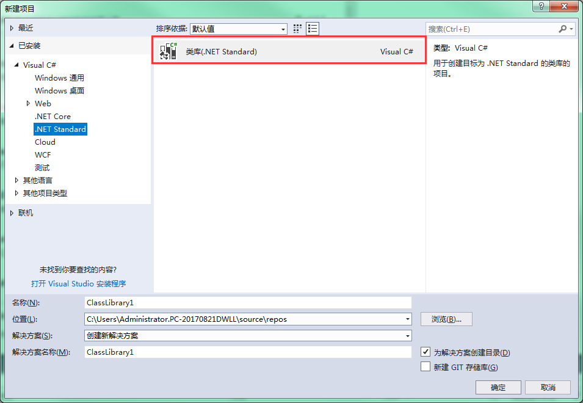
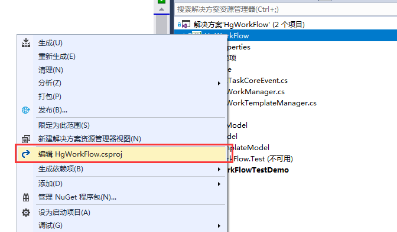
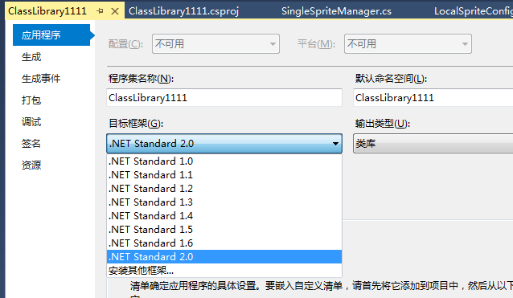
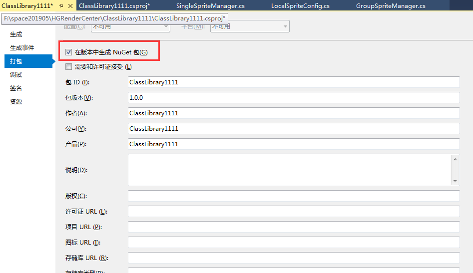
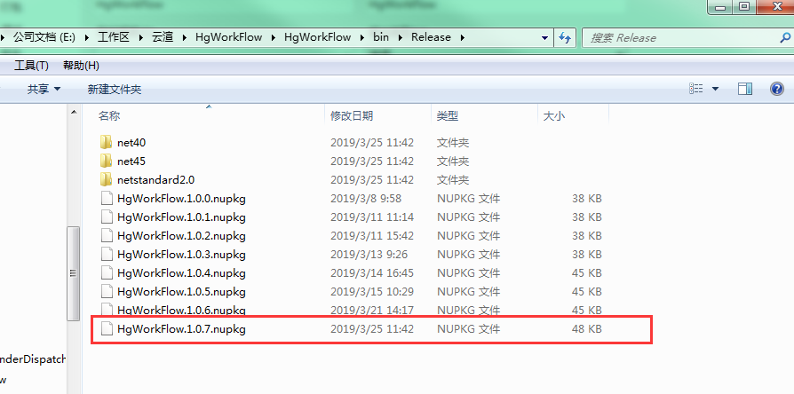

# 2.极简创建nuget包

1. 创建standard程序包



2. 右键项目，选择编辑 xxx.csproj



```csproj
<Project Sdk="Microsoft.NET.Sdk">
  <PropertyGroup>
    <TargetFrameworks>net40;net45</TargetFrameworks>
    <GeneratePackageOnBuild>true</GeneratePackageOnBuild>
    <AutoGenerateBindingRedirects>true</AutoGenerateBindingRedirects>
  </PropertyGroup>
</Project>
```

3. 更改输出Framework，修改支持多个输出平台

程序默认是通过此处设置输出框架，我们要修改支持多个平台

> 注意```TargetFramework```默认是单个，多个要设置```TargetFrameworks```



```csproj
<Project Sdk="Microsoft.NET.Sdk">
  <PropertyGroup>
    <TargetFrameworks>net40;net45</TargetFrameworks>
    <GeneratePackageOnBuild>true</GeneratePackageOnBuild>
    <AutoGenerateBindingRedirects>true</AutoGenerateBindingRedirects>
  </PropertyGroup>
</Project>
```

4. 发布前确认项目属性》打包




5. 打包结果



