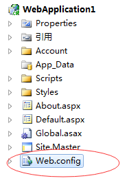
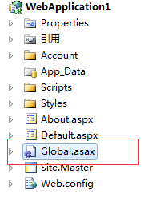
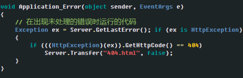
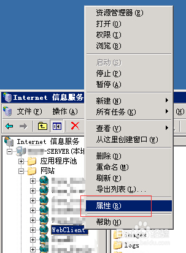

# Asp.Net学习

## 传递数据到页面

[ASP.NET MVC传递Model到视图的多种方式总结](https://blog.csdn.net/weixin_34203832/article/details/85965505)

- ViewData
- ViewBag
- PartialView
- TempData
- ViewModel
- Tuple

## 设置页面404错误跳转

### 1. Web.config 配置



```xml
<system.web>
    ...
    <customErrors mode="On" defaultRedirect="/">
        <error statusCode="404" redirect="/"/>
    </customErrors>
    ...
</system.web>
```

### 2. Global.asax 配置





### 3. IIS配置


