# Nuget服务

## 配置程序包源（引用内网nuget）

- VS调试》选项》Nuget包管理器》程序包源

or

- 右键点项目依赖项》管理Nuget程序包》程序包源（右上角）》设置按钮

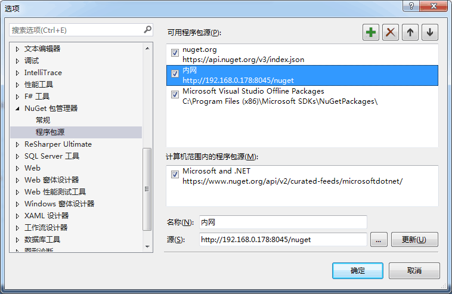

# 引用程序包

- 右键点项目依赖项》管理Nuget程序包》程序包源（右上角）》选择全部/刚刚创建的新源名称


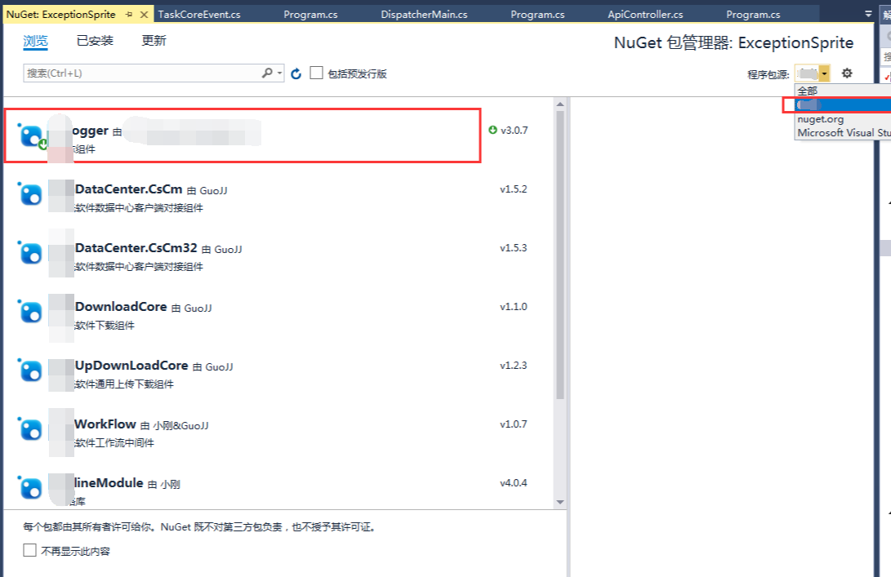

## 极简创建nuget包

1. 创建standard程序包

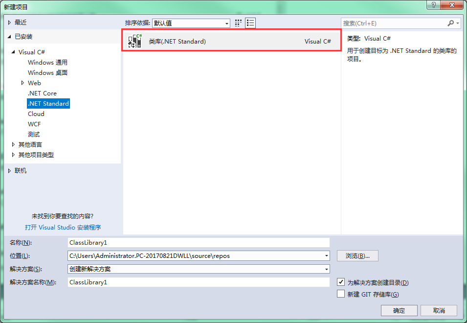

2. 右键项目，选择编辑 xxx.csproj

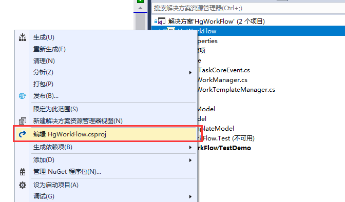

```csproj
<Project Sdk="Microsoft.NET.Sdk">
  <PropertyGroup>
    <TargetFrameworks>net40;net45</TargetFrameworks>
    <GeneratePackageOnBuild>true</GeneratePackageOnBuild>
    <AutoGenerateBindingRedirects>true</AutoGenerateBindingRedirects>
  </PropertyGroup>
</Project>
```

3. 更改输出Framework，修改支持多个输出平台

程序默认是通过此处设置输出框架，我们要修改支持多个平台

> 注意```TargetFramework```默认是单个，多个要设置```TargetFrameworks```

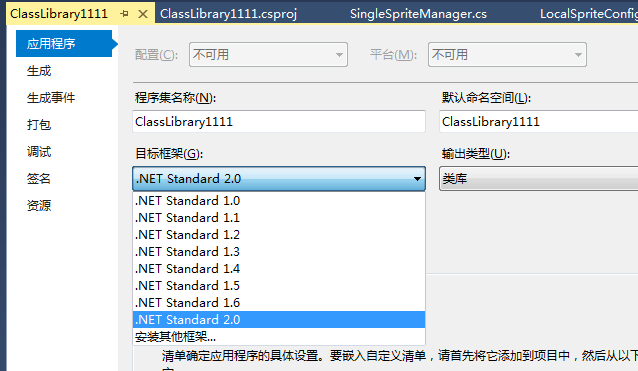

```csproj
<Project Sdk="Microsoft.NET.Sdk">
  <PropertyGroup>
    <TargetFrameworks>net40;net45</TargetFrameworks>
    <GeneratePackageOnBuild>true</GeneratePackageOnBuild>
    <AutoGenerateBindingRedirects>true</AutoGenerateBindingRedirects>
  </PropertyGroup>
</Project>
```

4. 发布前确认项目属性》打包

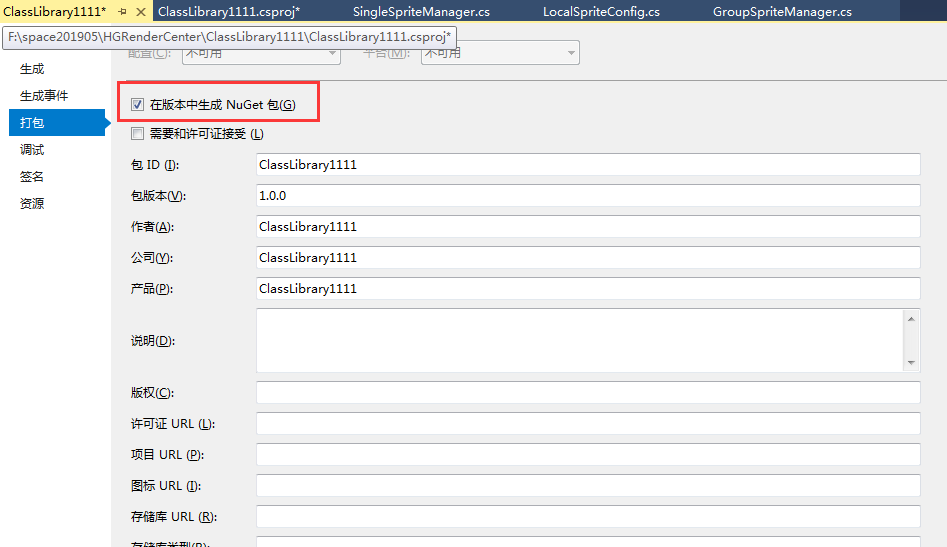

5. 设置软件版本

此行影响nuget包输出版本号，删除此行可以默认按照Version输出包版本号
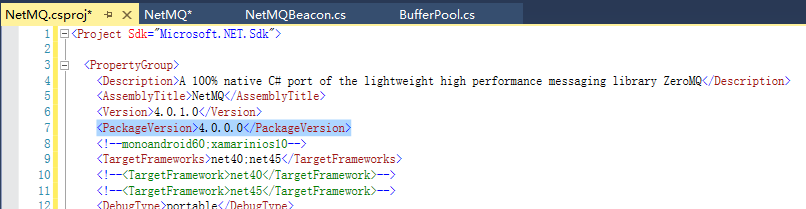

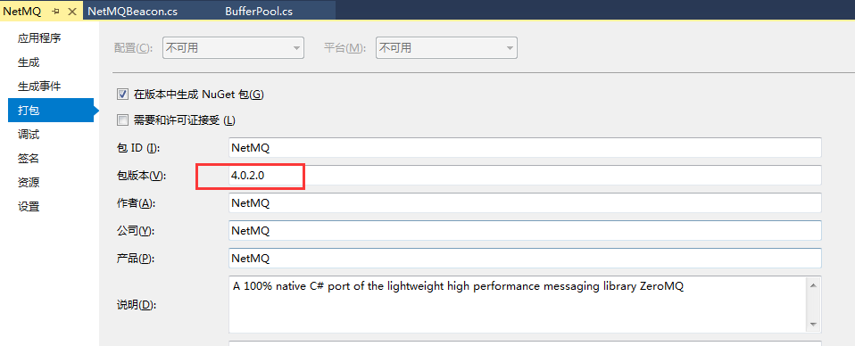

6. 打包结果

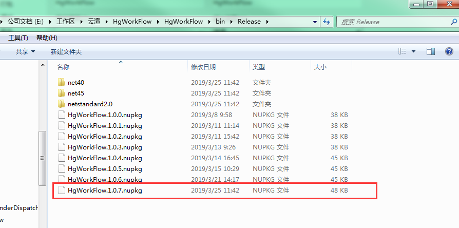

## 搭建内网nuget服务器

> https://docs.microsoft.com/zh-cn/nuget/hosting-packages/nuget-server
> https://github.com/NuGet/NuGetGallery

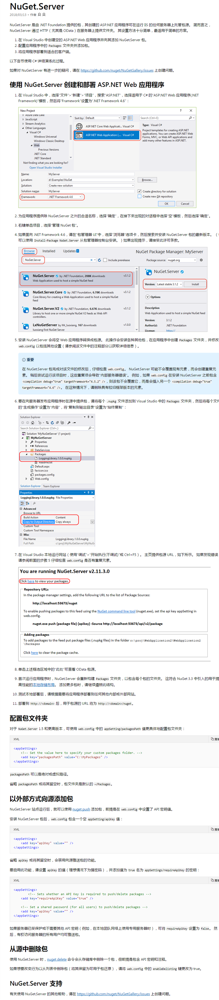

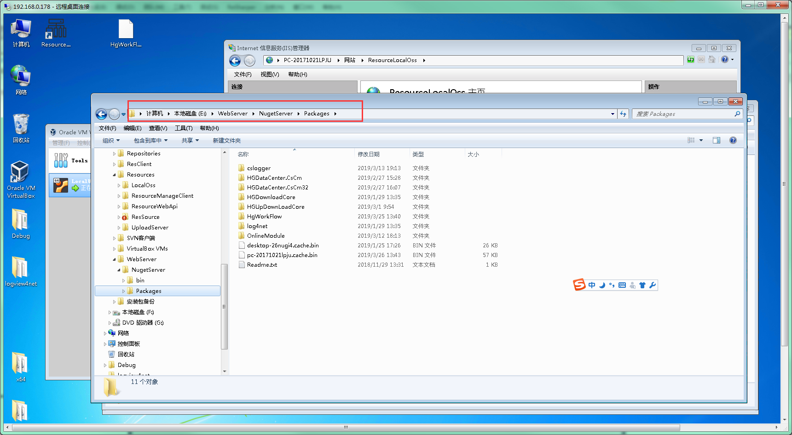