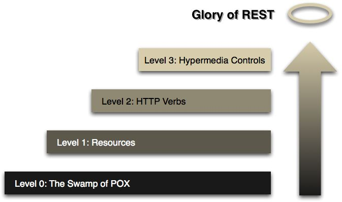

# restful api 设计指南

## 前后端分离的优缺点

### 没有分离

1. PC、APP、PAD多端适应
1. SPA开发模式开始流行
1. 前后端开发职责不清
1. 开发效率问题，前后端互相等待
1. 前端一直配合着后端，能力受限
1. 后台开发语言和模板高度耦合，导致开发语言依赖严重

### 分离

1. 前后端学习门槛增加
1. 数据依赖导致文档重要性增加
1. 前端工作量加大
1. SEO（搜索引擎优化）的难度增大
1. 后端开发模式迁移增加成本

## Restful 调用者视角

### 选定版本

> [https://api.example.com/v1/](https://api.example.com/v1/)
>
> 将版本号放在HTTP头信息中

### 面向资源

- GET /items：返回资源对象的列表（数组）
- GET /items/uid：返回单个资源对象
- POST /items：返回新生成的资源对象【非幂等，每次操作前须查询确认状态后操作】
- PUT /items/uid：返回完整的资源对象
- PATCH /items/uid：返回完整的资源对象【非幂等，每次操作前须查询确认状态后操作】
- DELETE /items/uid：返回一个空文档

### 服务器返回状态码表示操作结果

- 1xx：相关信息
  - 2xx：操作成功
  - 200 OK - [GET]：服务器成功返回用户请求的数据，该操作是幂等的（Idempotent）。
  - 201 CREATED - [POST/PUT/PATCH]：用户新建或修改数据成功。
  - 202 Accepted - [*]：表示一个请求已经进入后台排队（异步任务）
  - 204 NO CONTENT - [DELETE]：用户删除数据成功。
- 3xx：重定向
- 4xx：客户端错误
  - 400 INVALID REQUEST - [POST/PUT/PATCH]：用户发出的请求有错误，服务器没有进行新建或修改数据的操作，该操作是幂等的。
  - 401 Unauthorized - [*]：表示用户没有权限（令牌、用户名、密码错误）。
  - 403 Forbidden - [*] 表示用户得到授权（与401错误相对），但是访问是被禁止的。
  - 404 NOT FOUND - [*]：用户发出的请求针对的是不存在的记录，服务器没有进行操作，该操作是幂等的。
  - 406 Not Acceptable - [GET]：用户请求的格式不可得（比如用户请求JSON格式，但是只有XML格式）。
  - 410 Gone -[GET]：用户请求的资源被永久删除，且不会再得到的。
  - 422 Unprocesable entity - [POST/PUT/PATCH] 当创建一个对象时，发生一个验证错误。
- 5xx：服务器错误
  - 500 INTERNAL SERVER ERROR - [*]：服务器发生错误，用户将无法判断发出的请求是否成功。

[W3C返回状态码标准链接](https://www.w3.org/Protocols/rfc2616/rfc2616-sec10.html)

另外返回的body还可以带具体错误描述

```json
{
    error: "Invalid API key"
}
```

### 获取资源的搜索、过滤、传参

纯/拼接：

- GET /zoos：列出所有动物园
- POST /zoos：新建一个动物园
- GET /zoos/ID：获取某个指定动物园的信息
- PUT /zoos/ID：更新某个指定动物园的信息（提供该动物园的全部信息）
- PATCH /zoos/ID：更新某个指定动物园的信息（提供该动物园的部分信息）
- DELETE /zoos/ID：删除某个动物园
- GET /zoos/ID/animals：列出某个指定动物园的所有动物
- DELETE /zoos/ID/animals/ID：删除某个指定动物园的指定动物

也可以这样：

- ?limit=10：指定返回记录的数量
- ?offset=10：指定返回记录的开始位置。
- ?page=2&per_page=100：指定第几页，以及每页的记录数。
- ?sortby=name&order=asc：指定返回结果按照哪个属性排序，以及排序顺序。
- ?animal_type_id=1：指定筛选条件

> 参数的设计允许存在冗余，即允许API路径和URL参数偶尔有重复。比如，GET /zoo/ID/animals 与 GET /animals?zoo_id=ID 的含义是相同的

### Extra 额外扩展Http动词

- HEAD：获取资源的元数据。
- OPTIONS：获取信息，关于资源的哪些属性是客户端可以改变的。

### Extra Hypermedia API

RESTful API最好做到Hypermedia，即返回结果中提供链接，连向其他API方法，使得用户不查文档，也知道下一步应该做什么。

譬如，浏览器打开[
https://api.github.com/](
https://api.github.com/) 会返回下面的列表

```json
{
  "current_user_url": "https://api.github.com/user",
  "current_user_authorizations_html_url": "https://github.com/settings/connections/applications{/client_id}",
  "authorizations_url": "https://api.github.com/authorizations",
  "code_search_url": "https://api.github.com/search/code?q={query}{&page,per_page,sort,order}",
  "commit_search_url": "https://api.github.com/search/commits?q={query}{&page,per_page,sort,order}",
  "emails_url": "https://api.github.com/user/emails",
  "emojis_url": "https://api.github.com/emojis",
  "events_url": "https://api.github.com/events",
  "feeds_url": "https://api.github.com/feeds",
  "followers_url": "https://api.github.com/user/followers",
  "following_url": "https://api.github.com/user/following{/target}",
  "gists_url": "https://api.github.com/gists{/gist_id}",
  "hub_url": "https://api.github.com/hub",
  "issue_search_url": "https://api.github.com/search/issues?q={query}{&page,per_page,sort,order}",
  "issues_url": "https://api.github.com/issues",
  "keys_url": "https://api.github.com/user/keys",
  "notifications_url": "https://api.github.com/notifications",
  "organization_repositories_url": "https://api.github.com/orgs/{org}/repos{?type,page,per_page,sort}",
  "organization_url": "https://api.github.com/orgs/{org}",
  "public_gists_url": "https://api.github.com/gists/public",
  "rate_limit_url": "https://api.github.com/rate_limit",
  "repository_url": "https://api.github.com/repos/{owner}/{repo}",
  "repository_search_url": "https://api.github.com/search/repositories?q={query}{&page,per_page,sort,order}",
  "current_user_repositories_url": "https://api.github.com/user/repos{?type,page,per_page,sort}",
  "starred_url": "https://api.github.com/user/starred{/owner}{/repo}",
  "starred_gists_url": "https://api.github.com/gists/starred",
  "team_url": "https://api.github.com/teams",
  "user_url": "https://api.github.com/users/{user}",
  "user_organizations_url": "https://api.github.com/user/orgs",
  "user_repositories_url": "https://api.github.com/users/{user}/repos{?type,page,per_page,sort}",
  "user_search_url": "https://api.github.com/search/users?q={query}{&page,per_page,sort,order}"
}

```

## Restful 设计者视角

## API成熟模型



粗浅解释：

- Level 0 像一个普通的全局函数。（如果格式是XML，就是SOAP简单对象访问协议了，其中包含了要求的操作，操作的对象，以及数据）
- Level 1 面向资源，这对构建可伸缩、分布式的架构是至关重要的。（操作依然在传输数据中包含，只把Http当做一种传输通道，而不是传输协议）
- Level 2 把Http作为一种协议，通过HTTP动词（Get/Post/Put/Patch/Delete）对指定的资源进行操作（目前常见的Restful Api）
- Level 3 “将超媒体格式作为应用状态的引擎”（HATEOAS），核心思想是每个资源都有它的状态，不同状态下对它的操作不一样。（Restful “表述新状态转移” Representational State Transfer）对于使用者，只要知道如何获取资源的入口，之后的每个uri都可以通过请求获得，无法获得就说明无法执行那个请求。

## 参考链接

[RESTful API 设计指南](http://www.ruanyifeng.com/blog/2014/05/restful_api.html)

https://zhuanlan.zhihu.com/p/30396391


## 待读

[√ 理解RESTful架构 20110912](http://www.ruanyifeng.com/blog/2011/09/restful.html?bsh_bid=1717507328)

[√ RESTful API 设计指南 20140522](http://www.ruanyifeng.com/blog/2014/05/restful_api.html)

[√ RESTful API 最佳实践 20181003](http://www.ruanyifeng.com/blog/2018/10/restful-api-best-practices.html)

[前后端分离与restful api介绍](https://zhuanlan.zhihu.com/p/32901317)

[RESTful API 小型团队最佳实践](https://zhuanlan.zhihu.com/p/47226652)

[简单的Restful API例子(Golang)](https://blog.csdn.net/xcl168/article/details/43987247)

[RESTful 架构风格概述](https://blog.igevin.info/posts/restful-architecture-in-general/)

[Github REST API v3 Media Types](https://developer.github.com/v3/media/#request-specific-version)

[Github REST API v3 Users](https://developer.github.com/v3/users/#get-the-authenticated-user)
