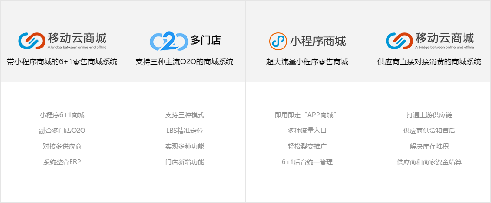

# 商城对比

## 开源仓库

TopicName|ResultCount|Url
---|:--:|---:
ecommerce|1888|[https://github.com/topics/ecommerce](https://github.com/topics/ecommerce)
e-commerce|710|[https://github.com/topics/e-commerce](https://github.com/topics/e-commerce)
store|655|[https://github.com/topics/store](https://github.com/topics/store)
shopping-cart|620|[https://github.com/topics/shopping-cart](https://github.com/topics/shopping-cart)
shop|552|[https://github.com/topics/shop](https://github.com/topics/shop)
shopping|317|[https://github.com/topics/shopping](https://github.com/topics/shopping)
cart|308|[https://github.com/topics/cart](https://github.com/topics/cart)
ecommerce-platform|273|[https://github.com/topics/ecommerce-platform](https://github.com/topics/ecommerce-platform)
online-shop|137|[https://github.com/topics/online-shop](https://github.com/topics/online-shop)
ecommerce-framework|52|[https://github.com/topics/ecommerce-framework](https://github.com/topics/ecommerce-framework)
shopping-cart-solution|42|[https://github.com/topics/shopping-cart-solution](https://github.com/topics/shopping-cart-solution)
estore|9|[https://github.com/topics/estore](https://github.com/topics/estore)
commerce|145|[https://github.com/topics/commerce](https://github.com/topics/commerce)

---

## 模板

- 收录时间：2019-6-30
- 开发语言：PHP
- 授权协议：商用授权
- 开发类型：开源（PC+H5可免费下载源码）
- 官方网站：[http://www.shopex.cn/](http://www.shopex.cn/)
- 简要评述：

---

## Ecshop（PHP）

- 收录时间：2019-6-30
- 开发语言：PHP
- 授权协议：商用授权
- 开发类型：开源（PC+H5可免费下载源码）操作系统：LINUX；Web服务器：Nginx(推荐) >= 1.8.0 ；PHP版本：>= 7.0；MYSQL：>= 5.6；Memcached：>= 1.4.2；PHP扩展：memcached fileinfo openssl Zend Guard Loader；
- 官方网站：[http://www.shopex.cn/](http://www.shopex.cn/)
- 简要评述：

---

## Fecshop (PHP)

- 收录时间：2019-6-30
- 开发语言：PHP
- 授权协议：BSD+
- 开发类型：开源，免费
- 官方网站：[https://github.com/fecshop/yii2_fecshop/](https://github.com/fecshop/yii2_fecshop/) | [http://www.fecshop.com/](http://www.fecshop.com/)
- 简要评述：
  - 真正开源的B2C电商商城，基于Yii2开发，一共六大入口，分别为 pc端（appfront）,wap端（apphtml5），后台（appadmin） ，vue端（appserver），第三方系统对接端（appapi），后台脚本端（console）。
  - 基于流行的Php Yii2框架开发的B2C商城框架。支持多语言，多货币，多入口设备，多store，让您快速的建设您的在线多语言商城
全新的商城框架体系，易于扩展升级，后期重构底层，方便您根据自己的需要进行二次开发
支持VUE 手机app等前后端彻底分离型应用
真正开源的电商系统，可以免费用于商业，让您免于版权纠纷
全面支持功能定制服务，可以通过付费方式开发定制功能，购买付费模板插件满足需要

---

## HiShop 海商 （asp.net）

- 收录时间：2019-6-30
- 开发语言：asp.net
- 授权协议：商用授权
- 开发类型：商用可购买二次开发、源码
- 官方网站：[https://www.hishop.com.cn/](https://www.hishop.com.cn/)
- 简要评述：

  - 零售系统

  - 分销系统

  - 新零售系统

  - 多用户商城系统

- 源码策略

---

### OpenCart (PHP)

- 收录时间：2019-6-30
- 开发语言：PHP
- 授权协议：社区版免费
- 开发类型：开源
- 官方网站：[https://www.opencart.cn/](https://www.opencart.cn/) | [https://github.com/opencart/opencart](https://github.com/opencart/opencart)
- 简要评述：
  - OpenCart 是近年来国内外非常流行的 PHP 开源电子商务网站系统。该电商网站系统安装方便，功能强大，操作简单。支持多语言、多货币和多店铺。OpenCart 外围开发生态圈发达，更有上万款免费和收费的模块插件和模板主题可供选择。代码完全开源，功能持续更新，代码结构清晰易懂，二次开发容易上手，入门门槛低。基于这些特点使得 OpenCart 快速成为了世界上广泛应用的 电子商务建站系统。
  - [专业版免费版对比](https://www.opencart.cn/comparison)
  - 

---

## 模板1

- 收录时间：2019-6-30
- 开发语言：PHP
- 授权协议：商用授权
- 开发类型：开源（PC+H5可免费下载源码）
- 官方网站：[http://www.shopex.cn/](http://www.shopex.cn/)
- 简要评述：

国内外著名开源b2c电子商务系统，大致情况如下：
一、国内知名B2C系统
1、Shopex国内最大的电子商务系统，有各种辅助工具，php开发，免费但不开源，网店模板众多，较适合有淘宝店的卖家。网址：www.shopex.cn
3、HiShop老牌的asp.net系统，免费但不开源，无法二次开发，而且后台功能做的也一般，操作不方便。网址：http://www.92hi.com/
4、V5Shop很不错的asp.net系统，免费但不开源，去年就声称要开源但至今未发布开源代码，不过该系统很适合企业做B2C，有很强的推广、促销功能等其它功能也相当强大，可做今后网站开发的功能参考。网址：http://www.v5shop.com.cn/
5、shopWe也是很不错的asp.net系统，只需3000元商业授权即可使用系统，但不开源。说它好是因为该系统前台模板做的很漂亮而且款式也比较多，建议开发前台模板时，参考这个系统。网址：http://www.shopwe.cn/Index.html
二、国外的B2C系统：
1、dashCommerce，它是开源且免费的，它是支持多语言版的，可替换网站模板的，但功能较弱，如果采用该系统开发，必须重新开发促销功能和适合国内用户的网站界面模板。网址：http://dashcommerce.org/default.aspx
2、nopCommerce，它是开源但不免费的系统，支持多语言，功能很丰富，在国外比较有名，有一个活跃的社区。它需要50美元去掉版权，20美元购买用户文档。网址：http://www.nopcommerce.com
3、petshop，是微软的.net技术展示系统，n层结构开发，包含了.net2.0的几乎所有的技术，但只有前台的简单的购物功能，没有后台功能。要使用它来开发系统需花很长时间。
国外的系统界面一般都不符合国内的用户使用习惯，而且所有的支付模块也要重新开发。
国内知名的B2C平台虽然都声称是免费的，但都只限于个人使用，要用于商业用途仍需付费。
ShopEx的服务报价：http://www.shopex.cn/Service_Solution/price.html
HiShop的服务报价：http://www.92hi.com/authorize/sqfw.htm
V5Shop的服务报价：http://www.v5shop.com.cn/service.html#df
通过以上的系统的比较，我个人建议公司使用php的ECshop或asp.net的dashCommerce，因为他们都是开源免费的都是有开源团队在维护和发展的。
推荐国外asp.net的dashCommerce的原因是：
1、 是完成开放源代码的、免费的（无需商业授权）、但文档支持不足。
2、 该系统在国外很受欢迎，有比较活跃的开发者群。
3、 系统功能：http://dashcommerce.org/dashCommerce/featuresmatrix.aspx
4、 虽系统功能只满足简单的购物功能，但系统设计优秀增加修改功能应比较容易。主要功能包括商品和订单的管理、可换肤、多语言、适合国外的支付平台等（如果公司有意向把生意做到国外的话这是不错的选择）
5、 不足是选择了它就表示得花很多时间来完善该系统，增加功能、修改支付方式、重新设计网站界面等。
在线体验dashCommerce：http://demo.dashcommerce.org/ 
前台真的很简陋
推荐国外asp.net的nopCommerce的原因是：
1、 除了要花点钱(70美元)购买商业版权和文档以外，系统是开源的，而且功能是强大的。
2、 是很成熟的系统，国外知名度高，国内也有一些开发爱好者。
3、 系统功能：http://www.nopcommerce.com/FeatureList.aspx
4、 不足同样和dashCommerce一样，要修改支付方式，重新设计适合国内用户使用习惯的网站模板。
在线体验：http://www.nopcommerce.com/Demo.aspx
开源之外的选择：
考虑到后台开发、前台设计、平台维护、网店推广和网店运营（主要包括一些在线客服系统、订单提醒、网店助手等）等成本，公司可以考虑asp.net 的非开源系统v5shop。
原因有以下几点：
1、 选择其它开源系统人力和时间成本比较高；
2、 经和其客服联系，购买该系统的专业版（首年13800，次年980）即是完全源版，并有开发文档和使用手册（这两点很重要，能为我们节省不少时间）。
3、 功能列表可以参看：http://www.v5shop.com.cn/vpro_shop_function.html
4、 服务列表可以参看：http://www.v5shop.com.cn/service.html#df
5、我认为这个系统v5shop为企业用户考虑了很多、很长远，有些也是我们一时没想到的，而且即使想到了，要做到也要花很多时间和人力，像适合各种商品类型的商品添加管理、SEO优化、商品促销、网店营销等。
在线体验v5shop：http://www.v5shop.com.cn/template.html#df
另外再推荐几款适合做外贸的php开源电子商务平台：
1、prestashop
http://www.prestashop.com/
2、ecart
http://www.ecartcommerce.com/about-us/
如果你想立刻佣有一个外贸电子商务平台，建设你选择它！如果您不懂技术可以联系我QQ：304884568。如果你是女性那也请你关注一下http://www.6bi9.cn
3、opencart
http://www.opencart.com/
4、zen-cart
http://www.zen-cart.cn/