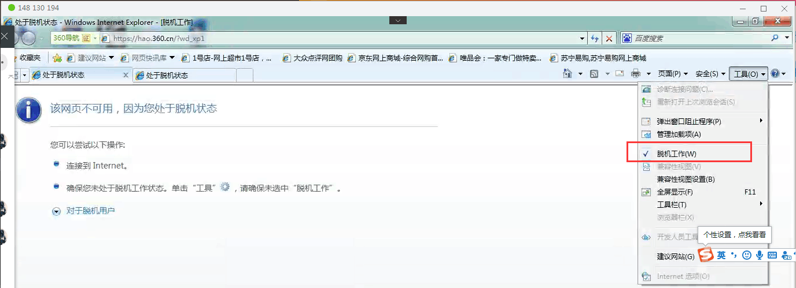

# 网络问题汇总及解决方案

## 检测网络

### 检测网络是否连通

检测对应域名是否连通可访问，检测对应ip地址是否公司服务器

```bat
>ping charge.hongguangren.cn

正在 Ping charge.hongguangren.cn [47.106.81.150] 具有 32 字节的数据:
来自 47.106.81.150 的回复: 字节=32 时间=8ms TTL=114
来自 47.106.81.150 的回复: 字节=32 时间=9ms TTL=114
来自 47.106.81.150 的回复: 字节=32 时间=9ms TTL=114
来自 47.106.81.150 的回复: 字节=32 时间=8ms TTL=114

47.106.81.150 的 Ping 统计信息:
    数据包: 已发送 = 4，已接收 = 4，丢失 = 0 (0% 丢失)，
往返行程的估计时间(以毫秒为单位):
    最短 = 8ms，最长 = 9ms，平均 = 8ms
```

## 通用修复

### 修改dns
修改dns为114.114.114.114 / 223.5.5.5

### 刷新dns
```bat
ipconfig /flushdns
```

### 重置网络
```ba
netsh winsock reset
```

## C# 修复

### 安装运行库 .Net Framework 4.5.2（兼容4.0 4.5 4.5.2）

[.net 4.5.2运行库安装路径： http://onlineinstall.hongguangren.cn/OnlineInstall/RuntimeLibrary/dotNetFx452.exe](http://onlineinstall.hongguangren.cn/OnlineInstall/RuntimeLibrary/dotNetFx452.exe)

[.net452 develop pack 开发包安装路径：http://download.microsoft.com/download/4/3/B/43B61315-B2CE-4F5B-9E32-34CCA07B2F0E/NDP452-KB2901951-x86-x64-DevPack.exe](http://download.microsoft.com/download/4/3/B/43B61315-B2CE-4F5B-9E32-34CCA07B2F0E/NDP452-KB2901951-x86-x64-DevPack.exe)

### Win10 系统默认自带.Net4.7，不兼容4.5.2/4.5/4.0

4.5/4.5.2 程序解决方案： 安装.net452 develop pack见上文

4.0 程序解决方案： *未解决*

## C++ 修复

### 安装运行库合集包

[C++运行库合集包安装路径：http://www.pc6.com/softview/SoftView_104246.html](http://www.pc6.com/softview/SoftView_104246.html)

### 系统找不到指定的文件。

错误输出的方式：

```cpp
try 
{ 
    ...
    CHttpFile* pFile = pServer->OpenRequest(CHttpConnection::HTTP_VERB_POST, cs_pathName); 
    ...
} 
catch (CInternetException* pEx) 
{ 
    ...
    pEx->GetErrorMessage(errorMsg,1024); // 系统找不到指定的文件。
    ...
} 
```

原因：客户机器进入了离线模式，所以虽然网页能访问到，ping也ping得通，程序版本库也是最新的，仍然不能链接服务器。

解决方法：


