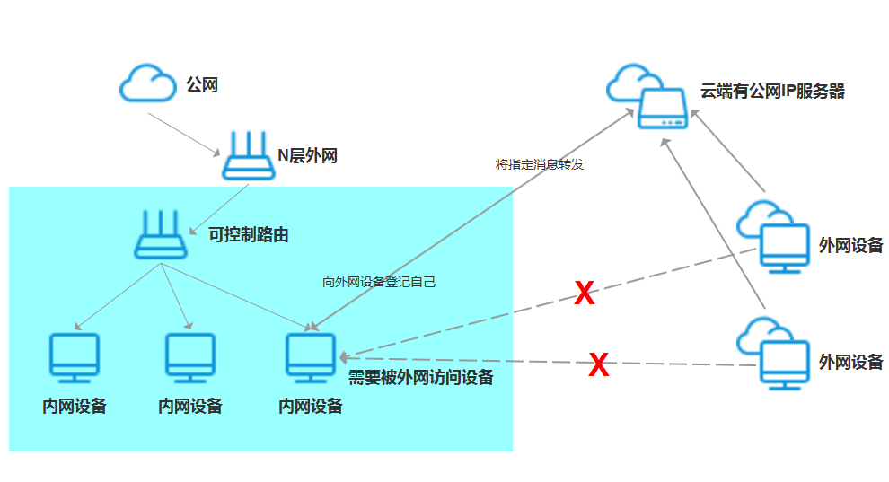
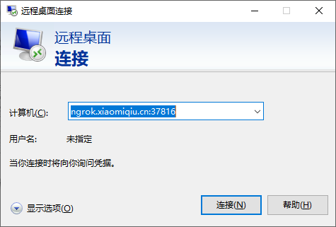
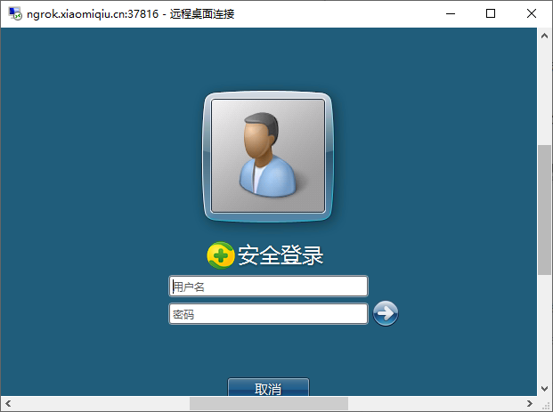
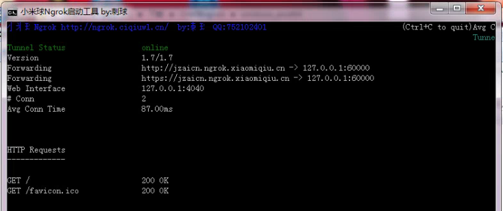

# 内网穿透

## ngrok

通过ngrok搭建内网穿透服务。

### 效果展示

### 搭建ngrok

### 使用ngrok

## 阅读

[√ 一分钟实现内网穿透（ngrok服务器搭建）](https://blog.csdn.net/zhangguo5/article/details/77848658)

[手把手教会你建立VPN专线的方法 随时远程接入](https://tech.hqew.com/news_1776723)

[Windows10如何搭建VPN服务器](https://jingyan.baidu.com/article/e9fb46e120d0aa7521f76624.html)
